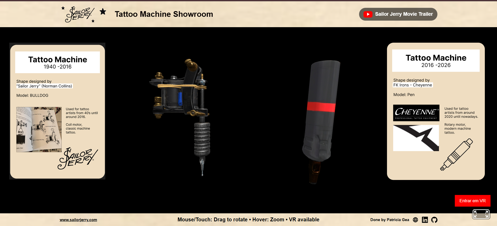

# ⚓ Machine Tattoo Showroom — WebXR Experience inspired by *Hori Smoku Sailor Jerry*

This project is based on the documentary *Hori Smoku Sailor Jerry: The Life of Norman K. Collins* (2008), which explores the life, influence, and legacy of Norman Keith Collins (Sailor Jerry), a key figure in the history of American tattoo culture. The WebXR experience translates this narrative into an interactive showroom where users can explore tattoo machines connected to his era and compare them with modern tattoo technology.

---

## ⚓ What

### Red Thread

The experience is focused on the connection between tattoo culture, Sailor Jerry’s legacy, and the documentary narrative. Users explore a VR showroom that visually represents the tools and technology associated with his influence and how tattoo machines evolved into modern devices.

### Hardware

* Desktop web browser
* Standalone VR headset (WebXR compatible)
* Mobile browser

### Technologies Used

* A-Frame
* WebXR
* HTML
* CSS
* JavaScript
* Meshy AI (Image-to-3D workflow)
* ChatGPT

---

## ⚓ Why

### Why is it interesting?

The project transforms a documentary narrative into an interactive VR experience, allowing users to engage with tattoo culture in an immersive and visual way instead of only watching the story.

### Portfolio relevance

It demonstrates the ability to:

* Translate film/documentary inspiration into interactive media
* Build WebXR experiences
* Integrate 3D assets into the web
* Design immersive storytelling environments

---

## ⚓ How

### Collaboration

The project was developed through research of the documentary content, 3D asset creation, and iterative WebXR scene development.

### Timeline

* Week 1: Analysis of documentary and concept planning
* Week 2: Image generation and 3D model creation
* Week 3: A-Frame VR showroom development
* Week 4: Testing and deployment

### Project Management

A Kanban board was used to organize tasks (To Do / In Progress / Done).

### Project Setup

* Web-based A-Frame VR scene
* GLB models for tattoo machines
* HTML/CSS/JavaScript structure
* Hosted on Vercel
* Source code on GitHub

---

## ⚓ Wrapping It Up

### Walkthrough

Users enter a VR showroom inspired by the documentary context. Inside the space, they can explore tattoo machines associated with Sailor Jerry’s influence and compare historical and modern designs through an immersive environment.

### Design Choices

A dark, minimal exhibition space was used to reflect a museum-like interpretation of the documentary themes and keep focus on the objects.

### Future Improvements

* Voice narration based on documentary themes
* Additional historical references from the film
* Interactive hotspots and annotations
* Hand tracking and more immersive VR interactions

### Reflection

This project helped translate documentary storytelling into an interactive WebXR experience. It strengthened skills in 3D web development, immersive design, and narrative-driven VR environments. In the future, I would like to expand this approach to other documentary-inspired interactive experiences.
